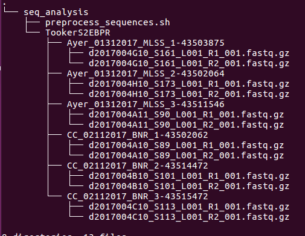



This is an attempt to put together a comprehensive tutorial for amplicon sequencing analysis. This is meant to get people new to amplicon sequencing analysis started. Modifications to the code will be required if you need to do anything more than the basic analysis.

# Software Installation Instructions
You are going to need the following software to run this analysis.

## FastQC
FastQC is a convenient software to check the quality of your reads. It is a java based application. So you need to make sure your system contains java. Check the install.txt file for instructions once you download the zip file and unzip it.

```bash
cd ${HOME}
#Download FastQC
wget http://www.bioinformatics.babraham.ac.uk/projects/fastqc/fastqc_v0.11.5.zip
#Unzip
unzip fastqc_v0.11.5.zip && cd FastQC
#Change permissions to make it executable
chmod 755 fastqc
#Create symbolic link in the local bin folder. Now you can just use the command fastqc from any directory
if [[ ! -d ${HOME}/bin ]]; then mkdir ${HOME}/bin; fi
ln -s ${HOME}/FastQC/fastqc ${HOME}/bin/fastqc
```
## Sickle
Sickle is a quality-trimming software that can be used to trim your sequences to a minimum quality score. Sickle can be downloaded from the github page [https://github.com/najoshi/sickle].

```bash
cd ${HOME}
#Download sickle. Update the v1.33 with the latest version number from the github page.
wget -O sickle.zip https://github.com/najoshi/sickle/archive/v1.33.zip
#Unzip. If you are downloading a different version than 1.33 then the code will require modification.
unzip sickle.zip && cd sickle-1.33
#Compile source code
make
#Change permissions
chmod 755 sickle
#Check if sickle is successfully built. If correctly done, the sickle version and developer information will be displayed
./sickle --version
#Create symbolic link in the local bin folder.
if [[ ! -d ${HOME}/bin ]]; then mkdir ${HOME}/bin; fi
ln -s ${HOME}/sickle-1.33/sickle ${HOME}/bin/sickle
```

## Mothur
Installing mothur is pretty easy. It comes precompiled as executable files.

```bash
cd ${HOME}
#Download mothur
wget -O Mothur.linux_64.zip https://github.com/mothur/mothur/releases/download/v1.39.4/Mothur.linux_64.zip
#unzip
unzip ../Mothur.linux_64.zip
#Add mothur to your path variable
export PATH=$PATH:${HOME}/mothur
#Create symbolic link
cd mothur
if [[ ! -d ${HOME}/bin ]]; then mkdir ${HOME}/bin; fi
for i in $(ls -1); do ln -s -T ${HOME}/mothur/$i ${HOME}/bin/$i; done
```

# Reference Databases
We will now download reference databases that are required for amplicon sequencing analysis.
## Silva
The [SILVA database](https://www.arb-silva.de/) is a comprehensive online, quality-checked database of aligned SSU  and LSU  rRNA sequences. The database needs a little bit of tweaking before it is compatible with mothur. The tweaked database is shared by the mothur creators [here](https://www.mothur.org/wiki/Silva_reference_files) (If you are interested in the steps to tweak the original database, see this [README](http://blog.mothur.org/2017/03/22/SILVA-v128-reference-files/) file posted by Pat Schloss). At the time of writing this tutorial, the latest version is Release 128. However we will still use v123 since the MiDAS database which we will also use was created using the v123. If you need the latest version of SILVA (v128) just head to the link given above and download it.

```bash
#Download the files
wget https://www.mothur.org/w/images/b/be/Silva.nr_v123.tgz
#unzip
tar -xzvf Silva.nr_v123.tgz
```

## MiDAS Taxonomy
The [MiDAS:Field Guide](http://www.midasfieldguide.org/) was created [McIlroy et al(2015)](http://database.oxfordjournals.org/content/2015/bav062.full?sid=6829f12b-4ae3-4258-acbe-d437059d55ac). This is a online resource that aims to help researchers and operators identify microorganisms relevant to wastewater treatment and understand their role. As part of this project, the researchers have also created the MiDAS taxonomy which is a manual curation of the SILVA taxonomy.

The MiDAS taxonomy comes formatted for QIIMe but not mothur. I created a script to format the taxonomy file to the mothur format (*github link coming soon*).

I will provide a link to the pre-formatted taxonomy file and the aligned sequences (fasta file) to you.


Now we have installed all necessary softwares and downloaded all required files. Let us proceed with some preprocessing steps and the actual analysis.

# Create Custom Alignment Database
We will first customize the SILVA database to our region of interest (V4). This is mainly to reduce computational memory and time required during our downstream analysis.

```bash
#Start mothur by just typing in mothur in the command line
mothur
```
If you see the output that ends with "mothur > " this means you are in the mothur command line. All mothur commands will work now. If you need to execute some unix commands from inside mothur, you can use the function system() and enclose your unix commands inside the brackets.

The command for performing a in-silico pcr is pcr.seqs. We will use the start and end parameter to specify the region of interest. This has been pre-determined for V4 sequencing.
```bash
pcr.seqs(fasta=silva.nr_v123.align, start=13862, end=23444, keepdots=F, processors=5)
#Rename the pcr file
system(mv silva.nr_v123.pcr.align silva.nr_v123.v4.align)
```
Next step is to preprocess our sequences to prepare them for mothur analysis.

# Preprocess Sequences
The folder organization for using this code is : create a folder called "seq_analysis" in your home directory.Inside that transfer the project folder from Illumina basespace. Inside the project folder, there should be folders for each sample within which there are the forward and reverse reads. Here is an example folder organization



Transfer the "preprocess_sequences.sh" into the your working directory (for example: seq_analysis). This folder will also contain the project folder "ProjectName" (For example: TookerS2EBPR).

The preprocessing steps are a little complicated, mainly because when the sequences come from the Illumina Basespace website, they have a lot of random numbers and letters associated with them. We want to change all the folder names and file names to something that is relevant to our analysis. I have only tested this on one dataset. We will have to see if we perform another sequencing run with UConn-MARS, if the dataset will look similar. Also if you perform sequencing with some other company, the data will probably look very different.

In this section of tutorial, we will perform the following steps:
1. Change the name of the files.
2. Decompress .fastq.gz files into fastq files.
3. Create symbolic links in a separate fastq folder for quality checking by combining all the forward reads and combining all the reverse reads.
4. Create FASTQC reports.
5. Perform sickle quality filtering on the fastq files in the sample folders, output files with same file name but with a prefix of "q".
6. Create a batch file for mothur in the bash script.
7. Create symbolic links for the quality-filtered files in a separate folder outside of the native folder organization.

All these steps will be accomplished by a script called "preprocess_sequences.sh". The ".sh" implies that it is a shell script. You will have to make some changes to the script. Here is the script (you don't have to copy paste anything. We will run the script directly from the file. Just copy the script file to your working directory)

In this script, there is a block of code (which is enclosed between lines of ###). This is the section you will have to change.

- Depending on your directory path, change ```"wdir=${HOME}/seq_analysis"``` to ```"wdir=your_working_directory"```.

- In the Discovery cluster, there is a folder called scratch where all temporary input files and output files can be stored. I usually like to create a folder called input_files (where I will keep all the files that mothur requires) and output_files (where I will store all the files that mothur generates). Depending on what the name and location of the input_files folder is , you should change ```"inputdir=/scratch/vnsriniv/input_files_test/"``` to ```"inputdir=your_input_directory"```

```Note: Always assume that anything on the cluster is not safe. So you should backup all the file locally on your computer. ```

```bash
cd seq_analysis
#We will first change a couple of things in the preprocess_sequences.sh file
vi preprocess_sequences,sh
```
Now the script will look like this.

```You will have to know how to use the vi editor. Familiarize yourself with some basic commands to use in vi. This is important. ```

```bash
#!/bin/bash

#The folder organization for using this code is : create a folder called mothur in your home directory. Inside that transfer the project folder from Illumina basespace to the mothur folder. Inside the project folder, there should be folders for each sample within which there are the forward and reverse reads.

#All the operations performed here are from the project directory. So navigate first to the project directory before running this script

#################CHANGE THIS####################################
wdir=${HOME}/seq_analysis
inputdir=/scratch/vnsriniv/input_files_test/
################################################################

#Create necessary folders
parent=`pwd`	#Store the project directory
mkdir ${wdir}/fastqc_files/	#Create a folder for fastqc

#Remove -randomnumber from folder names
for folder in *; do
	mv $folder ${folder%-*}; #Remove - and following characters from end of folder name
done

#Change .fastq.gz file names into foldername_R1/R2.fastq.gz
subdirs=`ls $parent`	#Store the names of all sample folders
for foldername in $subdirs; do
	files=`ls ${parent}/${foldername}/`	#Store the names of files inside the sample folder
	for filename in $files; do
		name=${filename%.fastq.gz}	#store the filename without the extension
		name2=${name#*L001_}	#Remove everything including and upto L001_ from the front
		name3=${name2%_001*}	#Remove everything and after _001 from the back
		newfilename=${foldername}_${name3}.fastq.gz	#Attach the foldername to R1/R2 and create new file name
		mv ${parent}/${foldername}/$filename ${parent}/${foldername}/$newfilename #Rename the old file with the new file name
		gunzip -d ${parent}/${foldername}/$newfilename #Decompress the fastq.gz file to fastq
		ln -s ${parent}/${foldername}/${newfilename%.fastq.gz}.fastq ${wdir}/fastqc_files/${newfilename%.fastq.gz}.fastq
	done
done

#Create FASTQC Reports. This assumes that you have installed FASTQC and have created a system path in /bin folder

#First concatenate all the forwards and reverse reads. Remove all the symbolic links.
cat ${wdir}/fastqc_files/*R1.fastq> ${wdir}/fastqc_files/forward_reads.fastq
cat ${wdir}/fastqc_files/*R2.fastq> ${wdir}/fastqc_files/reverse_reads.fastq
rm ${wdir}/fastqc_files/*R1.fastq
rm ${wdir}/fastqc_files/*R2.fastq
#Run FASTQC
fastqc ${wdir}/fastqc_files/forward_reads.fastq -o ${wdir}/fastqc_files/
fastqc ${wdir}/fastqc_files/reverse_reads.fastq -o ${wdir}/fastqc_files/
module load sickle/1.33
subdirs=`ls $parent`	#Store the names of all sample folders
for foldername in $subdirs; do
	forward=`ls ${parent}/${foldername}/*R1.fastq`	#Store the forward read file name
	reverse=`ls ${parent}/${foldername}/*R2.fastq`	#Store the reverse read file name
	sickle pe -f ${forward}  -r ${reverse} -t sanger -o ${parent}/${foldername}/q$(basename $forward) -p ${parent}/${foldername}/q$(basename $reverse) -s ${parent}/${foldername}/${foldername}_unpaired.fastq -q 20
done

#Create the mothur batch file
touch ${inputdir}/mothur.batch.files.txt
for foldername in $subdirs; do
	forward=`ls ${parent}/${foldername}/q*R1.fastq`	#Store the forward quality-filtered read file name
	reverse=`ls ${parent}/${foldername}/q*R2.fastq`	#Store the reverse quality-filtered read file name
	echo -e "$foldername\t$(basename $forward)\t$(basename $reverse)" >> ${inputdir}/mothur.batch.files.txt
done

#Copy all quality-filtered files to mothur folder
for foldername in $subdirs; do
	cp ${parent}/${foldername}/q*R* ${inputdir}/
done
```


After this is done, we can now run perform the preprocessing. **Make sure you are inside the project directory (in this case: TookerS2EBPR) before performing this operation.

```bash
bash ../preprocess_sequences.sh
```
This will take a while. As long as you don't see any error/warning messages, sit back and relax (or read a paper!!)

Once it is done, we should be ready to mothur these sequences!

# Mothur analysis
Most of the steps in this tutorial is from the [MiSeq SOP](https://www.mothur.org/wiki/MiSeq_SOP). I am repeating it here for convenience. But you should follow the MiSeq SOP so that you clearly understand each step and the choice of parameters!

Before you perform the following analysis, I would suggest you make sure all this analysis works by executing each step on a subset of your full analysis. I usually like to chose 2-4 samples to run the analysis on step by step and then perform a batch analysis for the whole dataset. If you have already done that, you can skip to the "Batch Analysis" section.

You can change the input and output directory and the logfile name to whatever you want. You can also change the no.of processors to the no.of cores in the node. This is not very well annotated because I probably won't do as good a job as the [MiSeq SOP](https://www.mothur.org/wiki/MiSeq_SOP) has done. So go there for explanation of each step!

```bash
mothur
#Now you should be inside mothur and you can run all these steps.
set.dir(input=/scratch/vnsriniv/RC_input_files, output=/scratch/vnsriniv/RC_midas_sansPrecluster_run)
set.logfile(name=RC_midas_sansPrecluster_run_log)
#Make contigs from paired end sequences
make.contigs(file=mothur.batch.files.txt, processors=10)
summary.seqs(fasta=current)
screen.seqs(fasta=current, group=current,summary=current,maxambig=0, maxlength=275,minlength=225)
unique.seqs(fasta=current)
count.seqs(name=current,group=current)
summary.seqs(count=current)
align.seqs(fasta=current,reference=silva.nr_v123.v4.align, flip=t)
summary.seqs(fasta=current,count=current)
screen.seqs(fasta=current,count=current,summary=current,start=8, end=9582, maxhomop=8)
summary.seqs(fasta=current, count=current)
filter.seqs(fasta=current, vertical=T,trump=.)
unique.seqs(fasta=current, count=current)
pre.cluster(fasta=current, count=current, diffs=2)
chimera.uchime(fasta=current,count=current, dereplicate=t)
remove.seqs(fasta=current,accnos=current)
classify.seqs(fasta=current, count=current, reference=MiDAS_v123_2.1.3.fasta, taxonomy=midas_mothur.tax, cutoff=80)
remove.lineage(fasta=current, count=current,taxonomy=current,taxon=Chloroplast-Mitochondria-unknown-Eukaryota)
cluster.split(fasta=current, count=current,taxonomy=current, splitmethod=classify, taxlevel=4, cutoff=0.03)
make.shared(list=current, count=current, label=0.03)
classify.otu(list=current, count=current, taxonomy=current, label=0.03)
count.groups(shared=current)
```
## Running mothur in batch mode
To run mothur in batch mode on cluster (we will assume you are running this on the Northeastern Discovery cluster which uses a SLURM job manager. Depending on the cluster you are using, the job submission method will be a little different).

You can copy the list of commands (above) and store it as a .txt file. See the mothur_batch_v4_script.txt file for an example.

Open a text editor and use the example script (below) to create a job submission script. Things that you might need to change include the job and error names and the partition name (depending on availability).

```bash
#!/bin/bash
#SBATCH --job-name=mothur_batch_v4_script_run
#SBATCH --error=mothur_batch_v4_script_run.error
#SBATCH --time=12:00:00
#SBATCH --partition=ser-par-10g-2
#SBATCH --ntasks=16
mothur mothur_batch_v4_script.txt
```

Save this file as mothur_batch_v4_job.sh

Now we can submit this job by running the following command

```bash
sbatch mothur_batch_v4_job.sh
```
